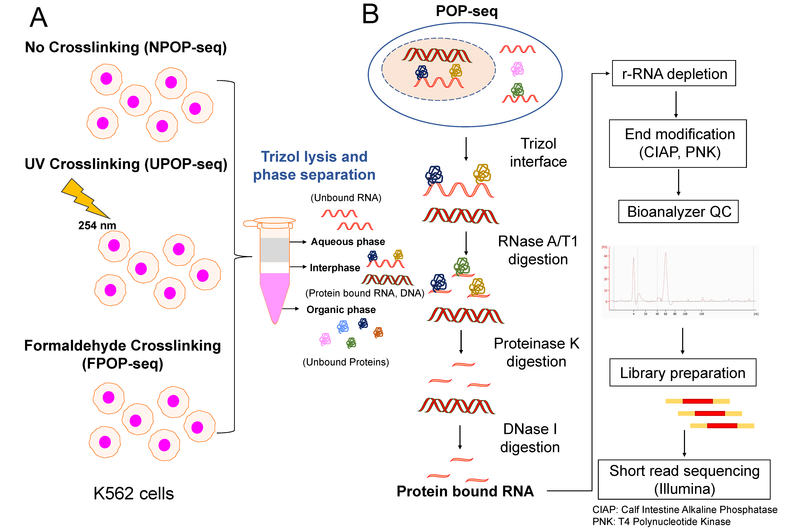

# Pipeline to analyse POP-seq data (_From alignment to peak calling_)

**Figure 1:** The complete workflow of POP-seq protocol in K562 cells and data analysis (A) Cells were lysed using trizol to generate three phases (aqueous, interphase and organic phase). Cell lysates from the POP-seq variants are digested with RNase A/T1 mix, Proteinase K and DNase followed by r-RNA depletion, RNA quality check and library preparation for illumina sequencing (B) Workflow for POP-seq data processing and downstream analysis.

# Prerequisites
Install below software as per user manuals:

fastqc (https://github.com/s-andrews/FastQC)

Samtools (https://github.com/samtools)

Bedtools (https://github.com/arq5x/bedtools2)

Hisat (https://daehwankimlab.github.io/hisat2/)

Piranha (http://smithlabresearch.org/software/piranha/) (from The Smith lab)

## Data-set public access:
	
UCSC-genome-browser: https://genome.ucsc.edu/s/Rajneesh/POP-seq-peaks_with_total_RNA_and_ENCODE-eCLIPs 

Gene Expression Omnibus (GEO): https://www.ncbi.nlm.nih.gov/geo/query/acc.cgi?acc=GSE142460

# Major steps involved in data processing
STEP 1: Download the raw sequencing data (FASTQ files) in local directory

STEP 2: Analyse the quality and statistics of reads using FASTQC-toolkits. 
	[Option: Check for the software installed in cluster/ local machine]

	module load java/1.7.0_25   
	module load fastqc/0.10.1
	fastqc -o /Out_Dir/ -f fastq /Sample.fastq 				# where Sample = fastq samples provided

NOTE: Check if all the files provided were of good quality (Generally Phred score > 30)

### How to use the next steps [3-5] of the pipeline [semi-automated]

Run Pipeline_POP-seq.py program as follows, to generate the multiple scripts (jobs) for data processing

	$ python Pipeline_POP-seq.py -h
	usage: Pipeline_POP-seq.py [-h] [-file [fq [fq ...]]]
                           [-modules [module [module ...]]] [-n N] [-p P]
                           [-w W] [-index INDEX] [-odir ODIR]

	Pipeline for POP-seq (fastq file) processing and peak calling

	optional arguments:
 	-h, --help            show this help message and exit
  	-file [fq [fq ...]]   input fast(q|a) file(s) optional:path/*.fastq
        			(default: None)
  	-modules [module [module ...]]
        		      module(s) required for data processing (default: None)
  	-n N                  number of nodes (default: 1)
  	-p P                  number of processors (default: 16)
  	-w W                  estimated wall time for process (default: 04:00:00)
  	-index INDEX          <path>/reference index file(s) (default:Reference/human/index/hg38*)
  	-odir ODIR            output directory path (default:./)

STEP 3: Align the high quality sequencing reads (from STEP 3) onto human reference genome (hg38) using Hisat (check your aligner!).
This includes two sub-steps:

	module load hisat/0.1.6        						# load module available in cluster/ machine
	
   1. Building up the indexes for reference genome  
  	
	hisat-build -f /Human/homosapiens.GRCh38.97.dna.toplevel.fa /Human/hg38.97/hg38.97    
	#Refernce genome (and .gtf file for annotation) for human were downloaded from Ensembl
		
   NOTE: This step is required just once to index the genome build and can be re-used in consequent step directly

   2. Alignment:
		
	hisat -p 32 -q -x /Human/hg38.97/hg38.97 -U Rep1.fastq /Output/Rep1.sam

STEP 4: Use samtools (check for module available in cluster/ local machine)
	for POST PROCESSING of the aligned reads
	
	module load samtools/1.2
	module load gcc/5.3.0
	module load bedtools/2.18.1						# load module available in cluster
	
	samtools view -bS /Output/Rep1.sam > /Output/Rep1.bam			# data compression
	samtools sort /Output/Rep1.bam /Output/Rep1.sorted	 		# sorting
	samtools index /Output/Rep1.sorted.bam					# indexing the bam
	bedtools bamtobed -i Rep1.sorted.bam > Rep1_sorted.bed			# convert bam to bed

STEP 5: Run piranha for peak calling from POP-seq data and identify binding peaks on RNA
	
	module load piranha-1.2.1						# load module available in cluster
	cd ./Output/
	./path/Piranha -l -s Rep1_sorted.bed -o output_Rep1_peaks.bed

STEP 6: For any downstream comparison of POP-seq peaks with publically available eCLIP OR fRIP OR ribo-seq peaks, below code identifies the intersecting peaks with 50% base-to-base overlap.
	
	bedtools intersect -f 0.50 -r -a POP-seq_peaks.bed -b RBP_eCLIP.bed|sort -k1,1 -k2,2n|uniq > POP-seq_intersect_peaks.bed     
